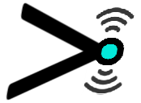

| [Documentation](ChatGPS/docs/Introduction.md) | [Development](#development-and-testing) | [Command reference](ChatGPS/docs/CommandReference.md) |
|-------------|-------------|-------------|

#  ChatGPS (preview)

[](https://adamedx.visualstudio.com/ChatGPS/_build/latest?definitionId=7&branchName=main)

**ChatGPS** enhances your interactive and scripted PowerShell sessions with artificial intelligence. With ChatGPS you can:

* **Generate PowerShell scripts** from words, not code
* **Incorporate AI** into PowerShell-based automation
* **Build agents:** enable language models to use specific PowerShell scripts on your system
* **Chat interactively** with language models without leaving your PowerShell terminal

ChatGPS supports several AI model providers such as OpenAI, Azure OpenAI, Anthropic, Google, etc., including local providers like Onnx and Ollama among others.

```powershell
PS > Connect-ChatSession -ApiEndpoint https://searcher-2024-12.openai.azure.com -DeploymentName gpt-4o-mini -ReadApiKey
ChatGPS: Enter secret key / password>: *****************

PS > Send-ChatMessage 'Hello World!'

Received                 Response
--------                 --------
3/11/2025 10:10:16 PM    Hello! How can I assist you today?
```

ChatGPS is built on [Semantic Kernel (SK)](https://github.com/microsoft/semantic-kernel), and works well with models and AI capabilities supported by SK.

# Installation and usage

Install ChatGPS from [PowerShell Gallery](https://powershellgallery.com/packages/ChatGPS) with the following PowerShell command:

```powershell
Install-Module ChatGPS
```

> ChatGPS is currently at an early *Preview* level of quality -- there may be rough edges, so please report issues on the repository's [Issues board](https://github.com/adamedx/ChatGPS/issues)!

## Prerequisites

To use ChatGPS, you'll need:
* [PowerShell](https://github.com/PowerShell/PowerShell) 7.4 and higher on Windows, Linux, or MacOS
* Models -- bring your own!
  * Remote: valid account credentials to a service like Azure OpenAI, OpenAI, Anthropic, etc.
  * Local: for locally hosted models including [Onnx](https://onnx.ai) and [Ollama](https://ollama.com), GPU or NPU capabilities may be needed depending on the specific model. Local models typically require the installation of client software before ChatGPS can use them, see the documentation for the [Connect-ChatSession](ChatGPS/docs/commands/Connect-ChatSession.md) command for details.

## How do I use ChatGPS?

Once the module is installed, you're only *two commands* away from language module interaction:

1. Use the `Connect-ChatSession` command to establish a connection to the desired language model
2. Use a command like `Send-ChatMesage` or `Start-ChatShell` to start chatting!

For example:

```powershell
Connect-ChatSession -Provider AzureOpenAI -ApiEndpoint https://myposh-test-2024-12.openai.azure.com -DeploymentName gpt-4o-mini # Add -ReadApiKey if you use an ApiKey
Send-ChatMessage 'Show me PowerShell code to get free physical memory in gigabytes on the system.'

Received                 Response
--------                 --------
8/30/2025 7:33:29 PM     ((Get-WmiObject -Class Win32_OperatingSystem).FreePhysicalMemory) / 1MB

Send-ChatMessage 'Can you show a version that uses megabytes instead?'

Received                 Response
--------                 --------
8/30/2025 7:33:29 PM     ((Get-WmiObject -Class Win32_OperatingSystem).FreePhysicalMemory) / 1KB
```

Note that each message you send with `Send-ChatMessage` refers to all previous messages sent and received, so you can have a continuing conversation. To clear the conversation and start over, use `Clear-ChatConversation`.

And rather than issue a command every time you want to have a "back and forth," you can use `Start-ChatShell` to have an interactive exchange, very useful for exploring solutions to a problem or just having a diverting conversation:

```powershell
PS > Start-ChatShell

(ryu) ChatGPS>: hello

Received                 Response
--------                 --------
9/7/2024 6:37:50 PM      Hello! How can I assist you today?

(ryu) ChatGPS>: Can you tell me which city is known as "The Motor City?"

9/7/2024 6:38:08 PM      Sure! "The Motor City" is a nickname for the city of Detroit, Michigan in the United States.

(ryu) ChatGPS>:
```

To exit the interactive chat loop, enter the command `.exit`.

Note that `Send-Chat` and `Start-ChatShell` contribute to the same session, so you can use one, then switch to the other, and of course switch again, and the conversation will simply continue.

### Agents and so much more

You can do more than just chat with language models -- you can make them into scriptable functions and even agents that can access the internet, parts of your local computer system, or other services for which you have access. To learn more, see the [detailed documentation](ChatGPS/docs/Introduction.md) for an inventory of ChatGPS capabilities and how to use them.

## Supported model providers

The following providers are supported by ChatGPS; in some cases a provider outside of this list that exposes the same API as one of these (e.g.OpenAI) or uses the same inferencing libraries may also work with ChatGPS:

|Provider     |Sample models                |Notes                                                    |
|-------------|-----------------------------|---------------------------------------------------------|
|Anthropic    |Claude Sonnet et. al.        |Plugin support currently unreliable                      |
|Azure OpenAI |GPT 4, GPT4o, custom         |Supports any model you've deployed using Azure           |
|Google       |Gemini 2.0, Gemini 2.5, etc. |                                                         |
|Ollama       |llama3, etc                  |Local models, requires Ollama client                     |
|Onnx         |Phi 3.5, Phi 4, etc.         |Local models, ChatGPS will install via Install-ChatAddOn |
|OpenAI       |GPT 4, GPT 4o, etc.          |Can be used with many models other than OpenAI           |

Each provider requires specific parameters for initialization; see the [authentication documentation](ChatGPS/docs/Authentication.md) for examples for each supported provider.

# Help and support

Please use this repository's [Issues board](https://github.com/adamedx/ChatGPS/issues) to post questions or report defects or request improvements.

# Development and contribution

ChatGPS is developed with both PowerShell and C# source code, and can be easily built using the `dotnet` tool. See the detailed [build instructions](BUILD.md) to build and run it yourself.

For information about contributing to ChatGPS, view the [CONTRIBUTING](CONTRIBUTING.md) documentation.

# Acknowledgments / attribution

* The [text to ASCII art generator](https://www.asciiart.eu/text-to-ascii-art) by [AsciiArtEU](https://www.asciiart.eu/link-to-us) was used to generate some of this project's ASCII art.

License and authors
-------------------
Copyright:: Copyright (c) Adam Edwards

License:: Apache License, Version 2.0

Licensed under the Apache License, Version 2.0 (the "License");
you may not use this file except in compliance with the License.
You may obtain a copy of the License at

    http://www.apache.org/licenses/LICENSE-2.0

Unless required by applicable law or agreed to in writing, software
distributed under the License is distributed on an "AS IS" BASIS,
WITHOUT WARRANTIES OR CONDITIONS OF ANY KIND, either express or implied.
See the License for the specific language governing permissions and
limitations under the License.

